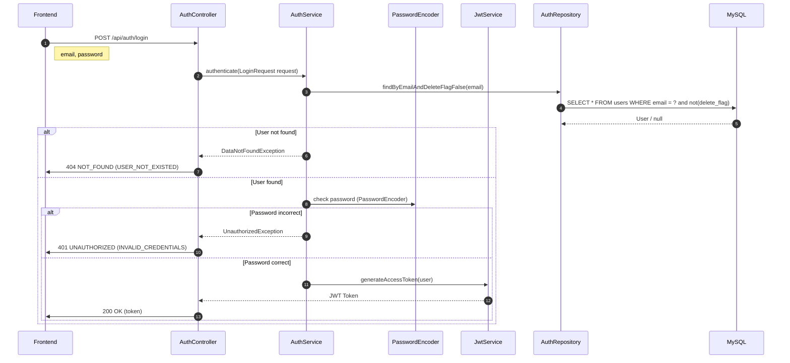

# FinFlow – Login Sequence Diagram

```mermaid
sequenceDiagram
    autonumber

    participant FE as Frontend
    participant API as AuthController
    participant ASV as AuthService
    participant PWE as PasswordEncoder
    participant JWT as JwtService
    participant REPO as AuthRepository
    participant DB as MySQL
    
    

    FE ->> API: POST /api/auth/login
    Note right of FE: email, password

    API ->>  ASV: authenticate(LoginRequest request)
    ASV ->> REPO: findByEmailAndDeleteFlagFalse(email)
    REPO ->> DB: SELECT * FROM users WHERE email = ? and not(delete_flag)
    DB -->> REPO: User / null

    alt User not found
        ASV -->> API: DataNotFoundException
        API ->> FE: 404 NOT_FOUND (USER_NOT_EXISTED)
    else User found
        ASV ->> PWE: check password (PasswordEncoder)

        alt Password incorrect
            ASV -->> API: UnauthorizedException
            API ->> FE: 401 UNAUTHORIZED (INVALID_CREDENTIALS)
        else Password correct
            ASV ->> JWT: generateAccessToken(user)
            JWT -->> API: JWT Token
            API ->> FE: 200 OK (token)
        end
    end
```
