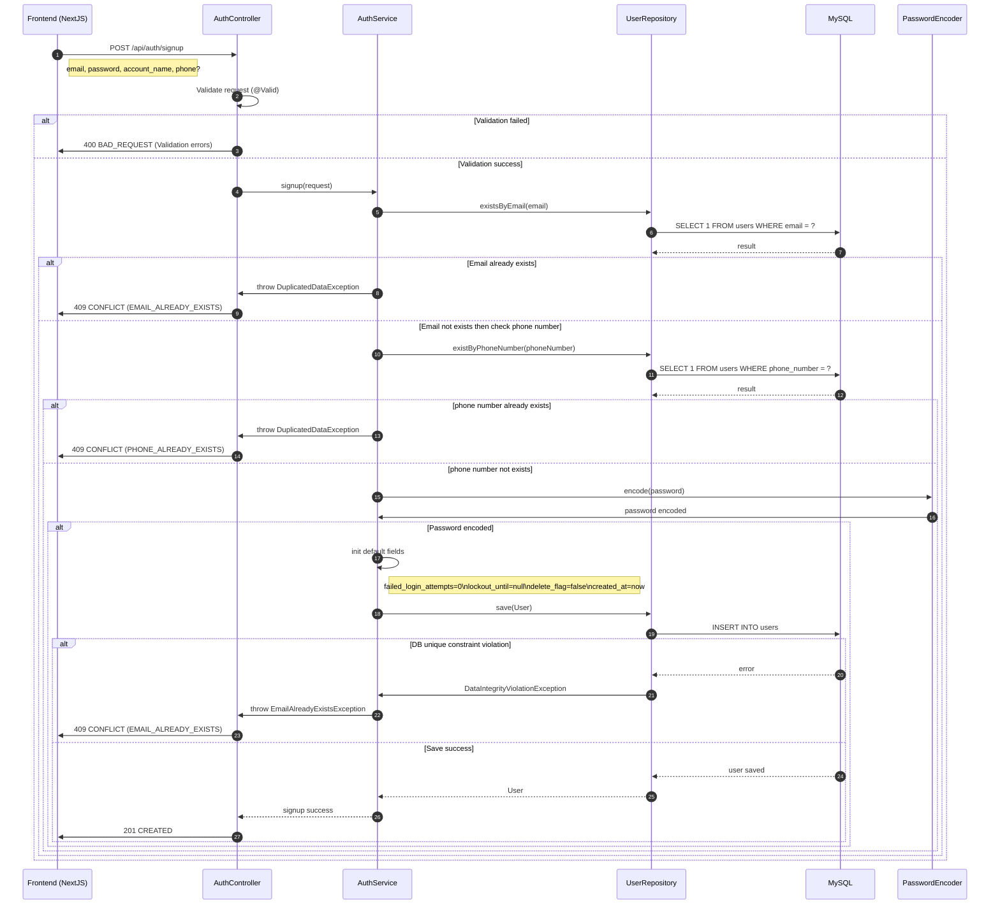

# FinFlow – Sign Up Sequence Diagram

```mermaid
sequenceDiagram
    autonumber

    participant FE as Frontend (NextJS)
    participant API as AuthController
    participant SVC as AuthService
    participant REPO as UserRepository
    participant DB as MySQL
    participant ENC as PasswordEncoder

    FE ->> API: POST /api/auth/signup
    Note right of FE: email, password, account_name, phone?

    API ->> API: Validate request (@Valid)

    alt Validation failed
        API ->> FE: 400 BAD_REQUEST (Validation errors)
    else Validation success
        API ->> SVC: signup(request)

        SVC ->> REPO: existsByEmail(email)
        REPO ->> DB: SELECT 1 FROM users WHERE email = ?
        DB -->> REPO: result

        alt Email already exists
            SVC ->> API: throw DuplicatedDataException
            API ->> FE: 409 CONFLICT (EMAIL_ALREADY_EXISTS)
        else Email not exists then check phone number
            SVC ->> REPO: existByPhoneNumber(phoneNumber)
            REPO ->> DB: SELECT 1 FROM users WHERE phone_number = ?
            DB -->> REPO: result
            alt phone number already exists
              SVC ->> API: throw DuplicatedDataException
              API ->> FE: 409 CONFLICT (PHONE_ALREADY_EXISTS)
            else phone number not exists
              SVC ->> ENC: encode(password)
              ENC ->> SVC: password encoded
              alt Password encoded
                  SVC ->> SVC: init default fields
                  Note right of SVC: failed_login_attempts=0\nlockout_until=null\ndelete_flag=false\ncreated_at=now

                  SVC ->> REPO: save(User)
                  REPO ->> DB: INSERT INTO users

                  alt DB unique constraint violation
                      DB -->> REPO: error
                      REPO ->> SVC: DataIntegrityViolationException
                      SVC ->> API: throw EmailAlreadyExistsException
                      API ->> FE: 409 CONFLICT (EMAIL_ALREADY_EXISTS)
                  else Save success
                      DB -->> REPO: user saved
                      REPO -->> SVC: User
                      SVC -->> API: signup success
                      API ->> FE: 201 CREATED
                  end
              end
            end
        end
    end
```
